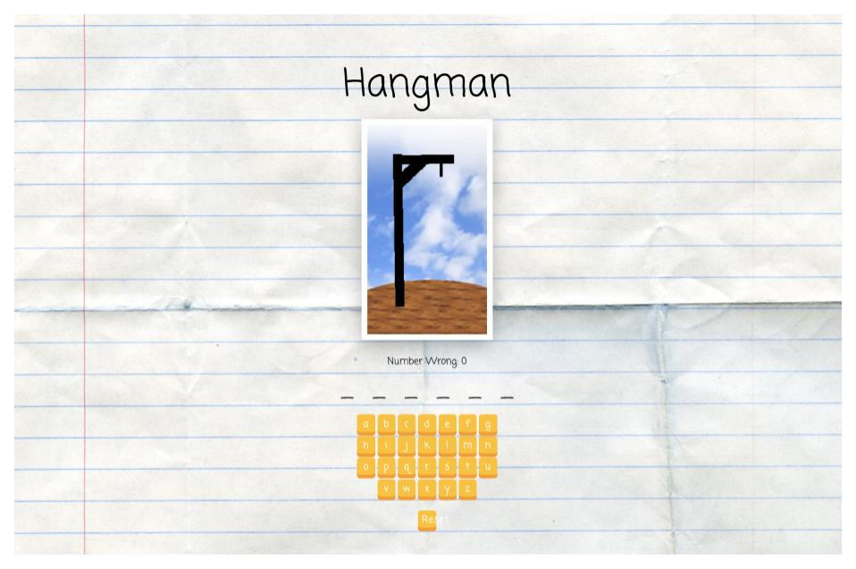

# **Hangman**

## Description
This game was an exercise from the Udemy course, "The Modern React Bootcamp" by Colt Steele.  This exercise was for educational purposes and was used to practice React concepts learned so far and include events, state, and props in order to create a functional Hangman game.  Using starter code, one could use this exercise to practice React concepts or code along with the instructor.

## Screenshot
  